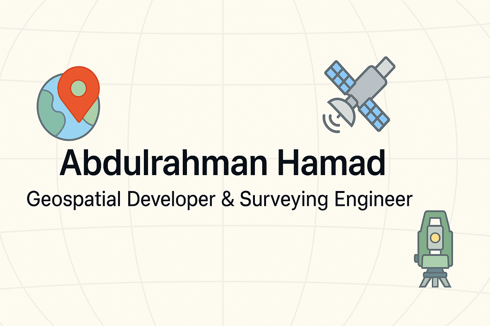
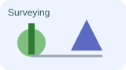
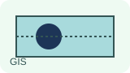
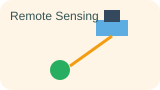
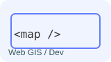

<!-- Banner -->

  

# Hi, I’m Abdulrahman Hamad
**Geospatial Developer & Surveying Engineer** · Riyadh, Saudi Arabia

I bridge **field surveying**, **GIS databases**, and **remote sensing analysis** into modern web-based geospatial solutions.
Passionate about **Civil 3D modeling, UAV photogrammetry, web GIS, and satellite imagery analytics**.

---

## 🔧 Tech Stack

  
  
  
  

**Surveying & Civil**: Civil 3D (surfaces, corridors, quantities), GNSS/RTK, Total Stations, UAVs, TBC, Metashape  
**GIS & Databases**: ArcGIS Pro, QGIS, PostGIS, GeoServer, GDAL/OGR, Spatial SQL  
**Remote Sensing**: Sentinel‑2, Landsat, NDVI, change detection, raster analysis  
**Programming**: Python (geopandas, rasterio), JS/TS (React, Next.js, Leaflet, MapLibre), Node.js

---

## 🚀 Featured Projects
### 🗺️ Surveying & Civil Engineering
- **Surveying Manager** — React/Node.js app to manage survey jobs, crews, and observations. → <https://github.com/wadaln3ma/Surveying-Manager>

### 🌐 Web GIS & Databases
- **Land/Parcel Management Dashboard** *(coming soon)* — Web GIS tool for parcel search, ownership, and spatial analysis.

### 🛰️ Remote Sensing
- **Sentinel‑2 Change Detection** — NDVI workflow for vegetation monitoring and land cover change. (repo coming soon)

### ✈️ Transport & Airspace
- **ADS‑B Flight Watch** — Python tool monitoring aircraft ADS‑B feeds, with alerts for corridor studies. → <https://github.com/wadaln3ma/plane-notify>

---

## 🎓 Certifications

  

- IBM Data Science Professional Certificate (Coursera)  
- GIS (UC Davis, Coursera)  
- GIS Fundamentals (2017)  
- GPS RTK Fundamentals (2016)  
- Android Basics Nanodegree (Google/Udacity)

---

## 📊 GitHub Stats

  
  

  

---

## 📬 Get in Touch

  

- Email: **[wadaln3ma@gmail.com](mailto:wadaln3ma@gmail.com)**  
- Portfolio: <https://wadaln3ma.github.io>  
- LinkedIn: *(add if you have one)*  
- Saudi Council of Engineers — Registered Surveying Engineer

---

> “Maps are the language of geography, but also the future of data.”
